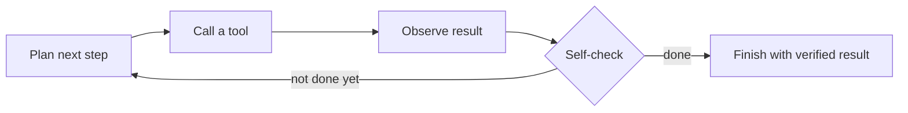

# Workflowww - Agentic Workflow Lab

Five working agentic systems on one shared core, with zero third-party
dependencies (pure Python standard library).

> **Resume framing:** Designed an agentic system that decomposes a task,
> invokes specialized tools, and self-verifies results - looping until the
> work is genuinely done.

This repo makes that sentence *demonstrable*. Every agent records a full
step-by-step trace (plan -> tool call -> observation -> self-check -> retry),
and an eval harness measures pass rates across tasks so you can show
improvement with real numbers.

## What's inside

| Agent | What it does | The loop you get to show |
|---|---|---|
| `pipeline_doctor` | Fixes a failing test suite in a repo | run tests -> read code -> write fix -> re-run -> repeat until green |
| `document_extractor` | Extracts fields from messy invoices and audits the numbers | extract -> validate -> fix wrong fields -> re-validate until clean |
| `deep_researcher` | Writes a report, then fact-checks every claim against sources | search -> draft -> verify -> drop unsupported claims -> rewrite |
| `qa_agent` | Tests a live web app and files bug reports | run scenarios -> detect failures -> file bugs with repro -> verify coverage |
| eval harness + trace viewer | Measures all of the above | pass rates per task + visual timeline of every run |

## The core loop



The shared engine in `core/` does exactly this: it asks the LLM for a JSON
decision (`thought`, `action`, `args`), executes the tool, runs a **truthful
verifier** against the actual outcome, and feeds failures back into the loop.
If the agent tries to finish early, the verifier rejects it with a concrete
explanation and the agent keeps working.

## Quickstart (no API key needed)

Run the full eval suite with the built-in offline demo brain:

```powershell
python scripts/run_eval.py
```

You get a summary like this:

```text
[PASS] pipeline-fix-1              2 steps
[PASS] invoice-extraction-1        9 steps
[PASS] research-company-report-1   7 steps
[PASS] qa-sample-app-bugs          4 steps
4/4 tasks passed
```

...plus `eval/results/<timestamp>/report.html`, a self-contained visual
timeline of every step (thought, tool call, observation, verify, retry).

Watch a single agent work end to end:

```powershell
python scripts/run_demo.py pipeline_doctor
python scripts/run_demo.py document_extractor
python scripts/run_demo.py deep_researcher
python scripts/run_demo.py qa_agent
```

Each demo prints the full trace and writes `traces/<agent>-<run>.html`.

## Using a real LLM

The demo brain is deterministic so runs are reproducible offline. To swap in a
real model, pick a backend:

**DeepSeek** (default model `deepseek-chat`):

```powershell
$env:DEEPSEEK_API_KEY = "sk-..."
python scripts/run_eval.py deepseek
```

Or copy `.env.example` to `.env`, paste your key there, and the project picks
it up automatically (`.env` is git-ignored and never overrides an already-set
environment variable):

```text
DEEPSEEK_API_KEY=sk-your-key-here
```

**OpenAI** (or any OpenAI-compatible provider):

```powershell
$env:OPENAI_API_KEY = "sk-..."
python scripts/run_eval.py openai
```

Optional overrides: `DEEPSEEK_MODEL` / `OPENAI_MODEL`, and
`DEEPSEEK_ENDPOINT` / `OPENAI_ENDPOINT` for a custom provider. All backends
share the exact same contract, so everything else stays identical. Note:
`deepseek-chat` is the JSON-safe default; the reasoning model may not support
JSON output mode.

## Project layout

```text
core/                     shared agent engine
  agent.py                plan -> act -> observe -> verify -> retry loop
  llm.py                  mock + OpenAI-compatible backends
  tools.py                tool registry
  tracing.py              per-run step traces
agents/
  pipeline_doctor/        agent #1 + sample repo with planted bugs
  document_extractor/     agent #2 + sample invoices with bad math
  deep_researcher/        agent #3 + offline fact corpus
  qa_agent/               agent #4 + sample web app with planted bugs
eval/
  harness.py              runs tasks, computes pass rates, saves traces
  reporting.py            renders trace/report HTML
  tasks.json              the task suite
scripts/
  run_eval.py             full eval + HTML report
  run_demo.py             single-agent demo + HTML trace
```

## The interview story

The project is designed to be *talked through*, not just pointed at. Three
moments land well:

1. **A real failure-and-recovery trace.** Open the researcher's trace: the
   agent drafted two claims that weren't backed by its sources, its own
   verifier flagged them ("missing from sources: [...]"), and it rewrote the
   report using only source-backed sentences. That is the exact behavior the
   resume line claims.
2. **The verifier catches premature finishing.** Walk through the QA trace:
   after each bug report, the self-check names the failures still missing
   coverage, and the agent keeps going until all three are documented.
3. **Measurement.** The eval harness turns "it works" into "4/4 tasks pass
   with N steps each." Add a task that trips your agent, fix it, and show the
   pass rate improving - that is how production agent teams work.

## Interactive visuals

Every workflow has a step-through visualization built from a real DeepSeek
run - see each thought, tool call, observation, and self-check in order:

- [Visuals hub](visuals/index.html) - the agentic loop + all four agents

## Honest notes

- The offline demo brain is a deterministic stand-in so the project runs
  anywhere with no keys and no installs. The real LLM backend does the same
  loop for real; use `openai` mode to see it.
- Sample fixtures deliberately contain planted bugs so the retry loops are
  visible. `pipeline_doctor` works on a fresh copy of the repo each run.

## Good next steps

- Add more eval tasks (harder repos, messier documents, multi-hop research).
- Add cost/step budgets and human-approval gates for risky actions.
- Add an agent "supervisor" that delegates to the four specialists.
- Wire the researcher to real web search, and the QA agent to a real app.
